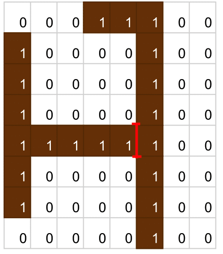

# Sjokoladeling

FOU-Alvene på Nordpolen har laget en sjokoladeplatemaskin som produserer sjokoladeplater med litt utradisjonelle former. Nissen liker initiativet, men lurer på om platene som produseres tilfredsstiller gjeldene krav fra staten med tanke på rettferdig deling mellom søsken. Som en del av innledende undersøkelser ber Nissen alvene finne ut hvor mange av platene som produseres tilfredsstiller kravene. Følgende krav stilles:

* Platen skal kunne deles i to deler.
* Det skal være like mange ruter i hver del.
* Det skal gjøres ett kutt.
* Kuttet er enten horisontalt eller vertikalt.
* Kuttet kan være så langt eller kort som nødvendig.
* Kuttet må starte og slutte i et hjørne på en rute.
* Alle rutene må være hele, kuttet må følge linjene.
* De to resulterende delene må selv være sammenhengende.

## Input

[Denne filen](src/sjokkis.txt) inneholder et vilkårlig utvalg sjokoladeplater. Alle filene beskriver sammenhengende plater. Maskinen produserer maksimalt 8x8 ruter store plater, og har serialisert platene som 64 tegn lange bit-strenger. De første 8 bitsene representerer den øverste raden, de neste 8 rad nr 2 og så videre.

Eksempel

0001110010000100100001001000010011111100100001001000010000000100 representerer denne sjokoladeplata:

Om den kuttes langs den røde linja ser vi at vi får to sammenhengende plater med like mange ruter.

1110101011111110110010001011100011110000100110000001100000000000 gir oss denne plata:

Delt langs den røde linja gir også denne to plater med like mange ruter. Legg merke til at dette telles kun som ett kutt, selv om det passerer gjennom et hull.

Oppgave

Hvor mange av sjokoladeplatene tilfredsstiller kravene?
