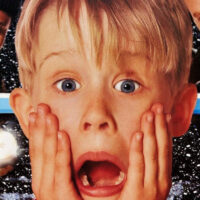

# Kvalitetskontroll av puslespill

På Nordpolen produseres det mange leker, deriblant puslespill. En av alvene har fått i oppgave å kontrollere at puslespillgeneratoren fungerer som tiltenkt og at puslespillene er løsbare. [I denne ZIP-filen](puzzle_pieces.zip) finner du 676 bildefiler som utgjør puslespillbitene. Noen av de er rotert. I [denne filen](src/puzzle.txt) finner du en linje per fil som beskriver de enkelte bitene. Tallene representerer tappene og hullene som sitter på kantene av puslespillbitene i rekkefølgen `opp, høyre, ned, venstre`, slik bitene er rotert nå. Alle tapper og hull som møtes skal summere til samme sum. Kanter langs yttersiden av bildet har verdi `-1`.

## Oppgave

Hva er navnet på karakteren avbildet på puslespillet?

## Eksempel
Følgende input kan illustreres:

```
lpsxoq.jpg, [-1, 7, 3, -1]
smqgba.jpg, [6, -1, -1, 2]
tbrwsp.jpg, [4, 5, -1, -1]
eqnhzb.jpg, [-1, 1, 0, -1]
```


Om vi roterer og plasserer bitene slik at alle tilstøtende sider summerer til 7 (0+7, 2+5, 1+6, 3+4): 


Får vi da følgende bilde av Kevin Mccallister.

